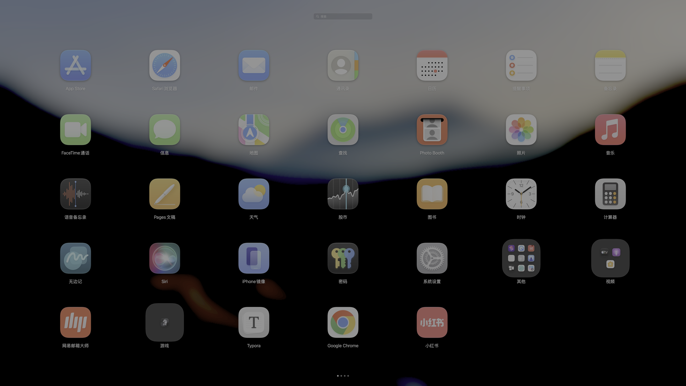
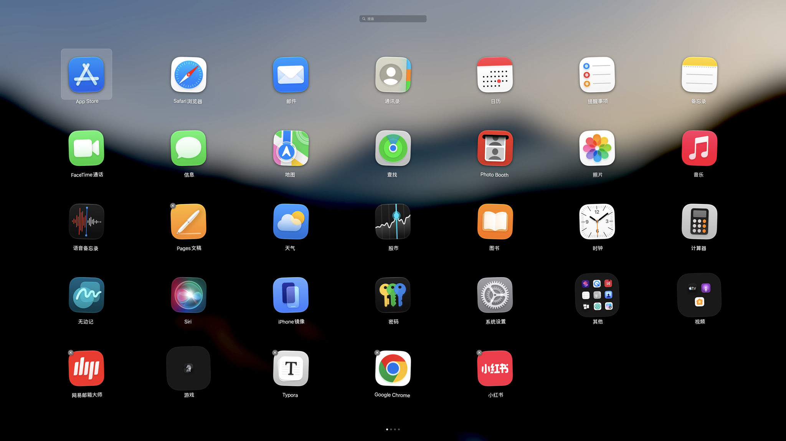
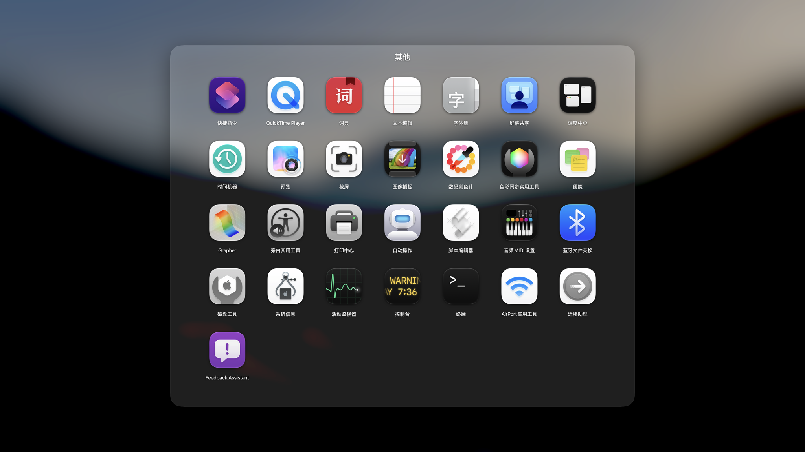
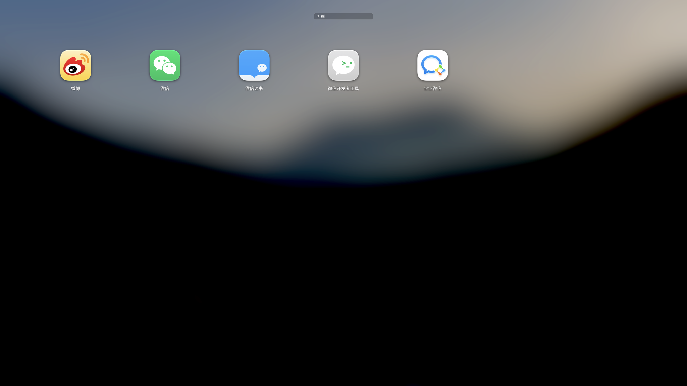
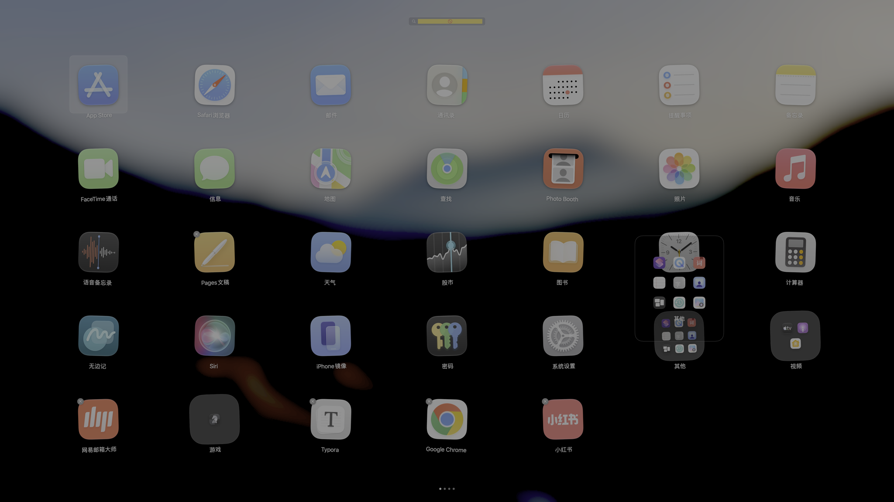
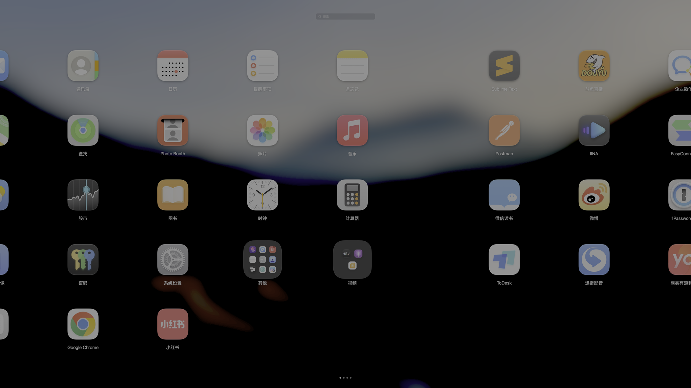
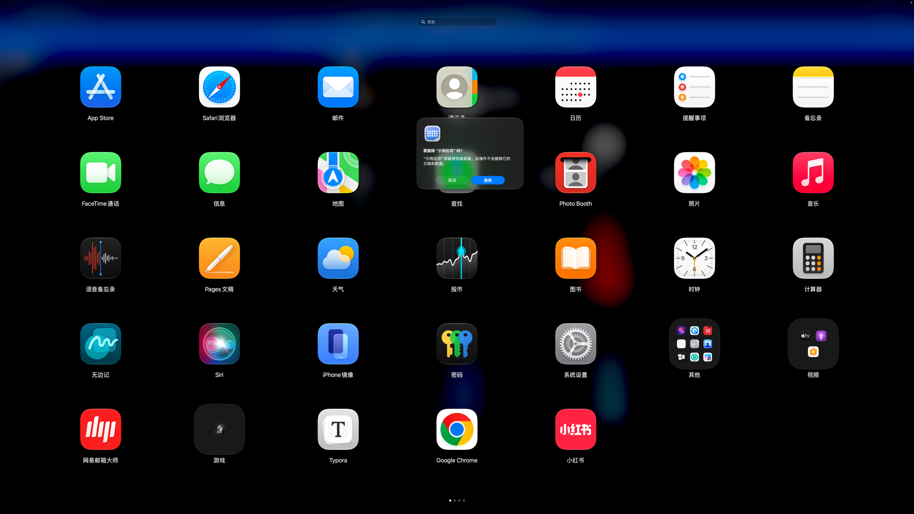

# 启动台 · Launchpad

把 macOS 26 之前那套「启动台」原样做回来。不只是外观 —— 打开时会直接读取系统里遗留的
启动台数据库（`com.apple.dock.launchpad`），把**分页顺序、文件夹、文件夹名称**原样恢复，
再补上所有交互细节（拖拽重排、自动建文件夹、抖动删除、搜索、分页手势/快捷键、多显示器）。



## 目录

- [为什么做这个](#为什么做这个)
- [功能](#功能)
- [安装](#安装)
- [版本记录](#版本记录)
- [使用](#使用)
- [偏好设置](#偏好设置)
- [数据与文件位置](#数据与文件位置)
- [从旧启动台导入](#从旧启动台导入)
- [构建](#构建)
- [命令行工具](#命令行工具)
- [测试](#测试)
- [代码结构](#代码结构)
- [实现要点](#实现要点)
- [已知差异与限制](#已知差异与限制)
- [卸载](#卸载)

## 为什么做这个

macOS 26 把启动台换成了 Spotlight 式的应用列表，很多人更习惯原来那套全屏网格。
这个项目用 SwiftUI + AppKit 把它重建出来，并且有两个额外的坚持：

1. **数据要接得上**：直接解析旧启动台数据库，用户的页面、文件夹、排序不用重新摆一遍。
2. **行为要对得上**：不是"看起来像"，而是把图标热区、拖拽吸附、悬停建文件夹、
   边缘翻页、抖动/删除规则这些细节逐个对齐（见[实现要点](#实现要点)）。

## 功能

| 分类 | 能力 |
| --- | --- |
| 布局 | 7×5 自适应网格（**每行图标数量可设 4–12 或自动**）、分页、页码圆点（可点击跳页） |
| 外观 | **背景透明度**（25%–100%）、**图标大小**（70%–135%，名称字号联动） |
| 图标 | 单击启动、拖拽实时重排、拖到屏幕边缘翻页、拖到末页右缘自动新建页 |
| 文件夹 | 悬停 0.5 秒自动建文件夹、拖到文件夹上放大预览并松手即入、拖出面板回到网格、空文件夹自动消失、文件夹内改名 |
| 编辑 | 抖动模式、可删除应用显示 ⊗、删除前确认、拖动中 ⊗ 保持显示 |
| 多选 | `⌘` 点选加选、`⌘` 拖空白处**框选**、`⌘A` 全选当前页；**整组拖拽**（拖到文件夹即整组入夹）、批量隐藏、批量移到废纸篓（带确认）、所选新建文件夹 |
| 信息 | `⌥` 点图标弹出**信息浮层**：版本与构建号、应用大小、路径、`bundle id`、最近打开时间、是否正在运行；一键「在访达中显示」 |
| 搜索 | 打字即搜（中文/输入法正常）、同一套网格样式筛选、↑↓ 选择、Return 打开 |
| 分页 | 背景拖动**跟手走满一整屏**（含橡皮筋）、双指滑动同样跟满一屏、松手接着手指速度滑完；⌘/⌃/⌥+←→、Page Up/Down、Home/End、⌘1–9、点圆点、拖图标到边缘都是整屏滑动 |
| 键盘 | 方向键选图标、Tab 切换、Return 打开、Esc 逐层退出 |
| 右键 | 打开 / 在访达中显示 / 移到废纸篓 / 从启动台隐藏 / 散开文件夹 |
| 多屏 | 指针所在屏幕显示网格，其余屏幕显示模糊背景 |
| 背景 | 三种模式：**系统模糊（默认，实时）** / 系统壁纸图片（只有壁纸、不含窗口）/ **自定义图片**（任意本地图片，可调模糊强度） |
| 性能 | 静止时**只渲染当前页**（35 个图标视图），滑动时才补相邻页；图标按需预热 |
| 常驻 | **程序坞图标**（左键点击直接进入，**可设置隐藏**）+ 菜单栏图标（左键直入、右键出菜单）+ 全局快捷键 + 登录时自启 |
| 动效 | 打开时整层淡入并让图标错峰弹入；关闭/启动应用时淡出收场；删除应用时图标消散、其余图标弹性补位；文件夹面板缩放展开 |
| 手势 | 触控板捏合打开/关闭启动台；双指左右滑动翻页；在空白处按住拖动跟手翻页 |

### 界面截图

| | |
| --- | --- |
|  |  |
|  |  |
|  |  |

## 安装

两种安装包都在 `dist/`（用 `Tools/make_package.sh` 生成）：

| 产物 | 说明 |
| --- | --- |
| `启动台 Launchpad 1.3.6.pkg` | 双击安装到 `/Applications`（推荐；`postinstall` 会清掉隔离属性） |
| `启动台 Launchpad 1.3.6.dmg` | 打开后把 app 拖进 `Applications`，内含中文安装说明 |

也可以直接拷贝：把编译出的 `Launchpad.app` 放进 `/Applications`。

> **升级请注意路径**：用 `.pkg` 装过一次之后，`/Applications/Launchpad.app` 的属主是
> `root:wheel`，普通用户无法直接覆盖（会提示 Permission denied）。后续升级请继续用
> 新版 `.pkg`（安装器会以 root 身份替换），或在访达里先删掉旧版（会要求管理员授权）。

### 签名身份与隐私授权

macOS 的隐私授权（屏幕录制等）记录的是应用的**指定要求（designated requirement）**：

- **ad-hoc 签名**的要求是 `cdhash H"…"`，**每次重新编译都会变** → 之前授的权会失效，
  于是每次启动都重新弹窗（本项目早期就是这个情况）。
- 用固定证书签名后，要求变成 `identifier "com.launchpad.app" and certificate leaf = H"…"`，
  重新编译也不会失效。项目自带一个本机自签名证书的方案：

```bash
Tools/setup_signing.sh        # 只需运行一次，创建 "Launchpad Local Signing" 证书
Tools/sign_app.sh <App.app>   # 用证书签名（没有证书时自动退回 ad-hoc）
```

`Tools/make_package.sh` 与 Xcode 的签名脚本都会自动走 `Tools/sign_app.sh`。
验证当前指定要求：`codesign -d --requirements - /Applications/Launchpad.app`。

### 首次打开

- 本应用是**本地 ad-hoc 签名、未公证**。若系统提示"无法验证开发者"：
  右键点应用 → 打开 → 再点"打开"，或到 系统设置 → 隐私与安全性 → 仍要打开。
- 背景的三种方式都不读屏幕："系统模糊"由 `NSVisualEffectView` 在系统合成层实时完成，
  另外两种只是读图片文件。

## 版本记录

### 1.3.6

- **修掉"松手时上一页突然消失"**：这是 1.3.1 引入的渲染优化带来的回归。
  `settle()` 里 `withAnimation { swipeOffset = 0 }` 会把**模型值立刻置 0**，
  而渲染规则是拿模型值判断"在不在滑动"的 —— 于是它认为已经停下，只按预取集合来画，
  而预取恰好在松手那一刻被清空，**滑出去的那一页当场被移出视图树**，
  它的位置直接露出背景，看起来就是突然消失（而不是继续滑出屏幕）。

  修法：翻页时把"起点页 + 终点页"钉进 `flippingPages`，直到动画结束才释放，
  动画期间只渲染这两页；动画放完再预取相邻页。

- 回归测试（自检 +3）：松手后两端页都在渲染集合里、动画期间上一页仍在渲染、
  动画结束后才释放。另外 `--pan-frames` 的换页帧也带上了 `flippingPages`，
  生成的逐帧图能直接看出上一页有没有跟着滑。

### 1.3.5

- **翻页动画回到 macOS 15 那种**：跟手时页面**跟着手指/鼠标走满一整屏**，松手后按
  减速曲线滑完（弹簧刚度加大到 `stiffness 240 / damping 30`，约 0.25 秒收敛、没有回弹尾巴）；
  点圆点 / 快捷键 / 拖到边缘统一改成 `easeOut`（0.26 秒起，跨页每多一页 +0.05 秒），
  不再有弹簧的拖尾声。
- **掉帧优化**（新增 `--perf-pan` 探针：在真窗口里连续滑三次，统计主线程调度间隔）：

  | 指标 | 优化前 | 优化后 |
  | --- | --- | --- |
  | 平均帧间隔 | 17.53 ms | **16.74 ms**（60fps = 16.7） |
  | P95 | 17.88 ms | **18.15 ms** |
  | 最差一帧 | 84.3 ms | **36.1 ms** |

  做法：
  1. **把"运动状态"从 controller 里拆出来**（`MotionState`）。图标格子观察的是 controller，
     而 SwiftUI 里被观察对象的任何 `@Published` 变化都会让**所有**格子重新求值 ——
     位移每帧都在变，等于每帧重算 100 多个图标的布局、阴影和文字。现在位移只有根视图观察。
  2. 给 `AppIconCell` / `GridPageView` / `WallpaperBackdrop` 加 `Equatable`，
     父视图重画时这几层可以直接跳过。
  3. 预取改到**回弹动画结束之后**（0.45 秒）再跑。之前是 0.25 秒，正好落在动画中间，
     等于在动画里现场构建 35 个图标视图，一次实打实的掉帧。
  4. 图标预热时把磁盘缓存里的 PNG **真正解码**（`NSImage(contentsOf:)` 是懒解码的），
     并把相邻页的标签字形用 CoreText 先烤一遍。

  已知的剩余成本：每构建一页（35 个图标）主线程会停顿约 30 ms，发生在预取时（空闲）或
  首次滑到某一页时。要彻底消掉需要把"每格一个手势"改成"整页一个手势"，属于较大的改动，
  留待需要时再做。

### 1.3.4

- **跟手翻页可以走满一整屏**：鼠标拖动原来只跟到 90%、双指滑动只跟到 **45%**，
  剩下的距离全靠松手动画一次窜过去 —— 这就是"有点突然"的主要来源。现在两者都能跟满一屏，
  和系统一样，手指带到哪页面就在哪。
- **松手动画接着手指速度**：用最近 0.12 秒的位移采样估算速度，按剩余距离归一化后
  作为弹簧初速度，动画从当前速度继续减速，而不是从 0 重新加速（那种"顿一下再窜过去"）。
  速度有上限，甩太狠也不会冲过头。
- 落位曲线换成 `interpolatingSpring(stiffness: 130, damping: 22)`；
  圆点/快捷键翻页的弹簧也放慢一档（`response 0.38 + 0.07/页`，`damping 0.92`）。
- 自检 +4 项：跟手最多一整屏、双指滑动同样满屏、只拖 40% 时余下距离由动画滑完、
  松手后结束跟手状态。

### 1.3.3

- **翻页动画统一成系统那样**：
  - 点页码圆点、`⌘←/→`、`⌃/⌥←→`、`Page Up/Down`、`Home/End`、`⌘1–9`、拖图标到屏幕边缘 —— 这些以前是**瞬间跳过去**的，
    现在和拖动一样是**整屏平移**（带阻尼的弹簧，跨页多时自动加一点时间）。
  - 实现上是"先把目标页摆在屏幕外渲染一帧（这一帧和当前画面完全一致），下一帧再开始滑"，
    所以入场页是滑进来而不是淡入；跨页跳转会把**起点到终点之间所有页**一起纳入渲染，
    否则中间那几屏会看到背景闪一下。
  - 松手回弹从 `easeOut` 换成 `spring(response: 0.28–0.44, dampingFraction: 0.88)`，
    落位更像系统那种"减速停住"。
- 界面上**去掉"免权限"字样**（背景方式的选择项与说明、安装说明、README 里对当前功能的描述）。
  历史版本记录里的说明保留，因为那是当时变更的事实记录。

### 1.3.2

- **自定义背景图默认加模糊**（之前是原图直出）。走的是和系统壁纸同一套管线
  （`ImageEffects.backdrop`：半分辨率 + 高斯模糊），但**不额外压暗、不调色**，
  亮度仍旧交给"背景不透明度"滑杆，免得把用户自己的照片染色。
- 新增「**背景模糊**」滑杆（只在选自定义图片时出现）：0 = 原图，默认 40，最右 80；
  拖动时实时生效。
- 缓存键带上模糊值，改滑杆不会拿到旧图；背景来源会在 `backdrop.log` 里记成
  `custom-image-blur40` 这种形式。
- 自检 +6 项（默认值、上下限夹取、两种强度都能出图、**像素级验证模糊真的生效**：
  用左红右蓝的测试图，断言接缝两侧像素差 > 25 且蓝色确实渗进了红色一侧）。

### 1.3.1

- **修掉"分页滑动有点奇怪"**：这是 1.3.0 引入的回归。换页那一瞬间 `page` 会跳一格、
  `swipeOffset` 同时补上一整屏宽，而当时的渲染规则把**新的下一页**也算进去了 —— 那一帧它
  其实完全在屏幕外，却要现场构建 35 个图标视图，正好压在动画第一帧上。
  用新增的逐帧诊断（`--pan-frames`）实测：

  | 帧 | 修复前 | 修复后 |
  | --- | --- | --- |
  | 换页那一帧 | 73.7 ms | 31.7 ms |
  | 拖动第一帧（已预取） | 48.1 ms | 31.4 ms |
  | 拖动后续帧 | 32.1 ms | 32.9 ms |

- 渲染规则改成**方向感知**：偏移为负时只建"当前页 + 右侧下一页"，反之只建"当前页 +
  左侧上一页"（只有这两页可能出现在屏幕上）。
- 静止 0.25 秒后**分两步预取**相邻页（先下一页、0.15 秒后补上一页），起步拖动不再有
  一次性构建开销；预取过的页在滑动期间**保留**，否则 SwiftUI 会把它们销毁、下次又得重建。
- 新增开发用诊断：`Launchpad --pan-frames <目录>` 逐帧渲染翻页动画、打印每帧耗时并落盘。

### 1.3.0

- **多选 / 框选 / 批量操作**：`⌘` 点选加选、`⌘` 拖空白处拉框选、`⌘A` 全选当前页；
  拖动**已选中**的图标会整组一起搬走（角标显示数量），拖到文件夹上整组入夹；
  右键可以对整组「新建文件夹 / 隐藏 / 移到废纸篓（带确认）」。批量删除前会列出所有项目名。
- **自定义背景图片**：偏好设置 → 外观 →「选择图片…」。图片会复制进应用支持目录
  （原图移动/删除不影响），按屏幕裁剪且**不模糊**；亮度仍由"背景不透明度"控制。
  图片丢失时自动退回系统模糊，不会留一片黑。
- **应用信息浮层**：`⌥` 点图标弹出卡片，显示版本与构建号、大小、路径、`bundle id`、
  最近打开时间（优先 Spotlight 的 `kMDItemLastUsedDate`，其次文件访问时间，
  最后是启动台自己的启动记录）、是否正在运行；带「打开」「在访达中显示」按钮。
- **隐藏程序坞图标开关**：偏好设置 → 启动。隐藏后仍可从菜单栏图标、快捷键唤起，
  退出也走菜单栏菜单（`NSApp.setActivationPolicy(.accessory)`，无需重启）。
- **懒渲染相邻页**：静止时只构建当前页（35 个图标视图），只有真的在滑动时才补上
  左右相邻页，翻页更顺；规则抽成 `PageRenderPolicy`，自检里直接断言。
- 修掉一个签名相关的坑：专用签名钥匙串闲置自动上锁后，`codesign` 会弹
  "codesign 想使用 launchpad-signing 钥匙串"的图形密码框，把自动打包卡住。
  现在 `Tools/sign_app.sh` 会先静默解锁并修复分区列表，不会再弹窗。
- 自检从 120 项增加到 **172 项**（新增多选/框选/成组拖拽/批量隐藏/删除确认/
  自定义背景导入与丢失兜底/Dock 开关/信息浮层字段/渲染策略）。

### 1.2.1

- **修掉"背景不透明度"滑杆没反应**：`LaunchpadRootView` 创建 `WallpaperBackdrop` 时漏传了
  遮罩浓度，视图只能用默认的 0.30，滑杆改了偏好也没接到画面上。现在遮罩直接从
  `Prefs.backdropDim` 读取（`WallpaperBackdrop.currentOverlayDim`），不再依赖调用方传参，
  从根本上避免再次漏传。
- 自检新增 6 项：遮罩换算（100% → 0、40% → 0.60、25% → 0.75、打开文件夹 +0.12、上限 0.85）
  并且断言它是跟随偏好设置的。

### 1.2.0

- **彻底删除"截屏桌面"背景**：项目里再没有任何 `CGRequestScreenCaptureAccess` /
  `CGWindowListCreateImage` 之类调用，安装后**永远不会申请屏幕录制权限**
  （旧版本留下的 `screenshot` 设置、`useScreenshotBackdrop`、`liveBackdrop` 键会被清掉）。
- 新增三项外观设置（偏好设置 → 外观，改动实时生效）：
  **背景不透明度**（25%–100%）、**图标大小**（70%–135%，名称字号联动）、
  **每行图标数量**（自动 / 4–12）。列数变化时按当前页容量顺序重新分页，不会溢出屏幕。
- 偏好设置窗口抬到覆盖层之上，可以一边开着启动台一边调；菜单栏改为
  「切换背景（系统模糊 / 系统壁纸图片）」。
- 自检新增 29 项（共 120 项）：默认背景方式、旧设置迁移与清理、三个滑杆的夹取、
  几何真的跟着变、分页重排与"只拆超容量页"。
- 自检改为在隔离目录里运行，不再改写你自己的 `layout.json`。

### 1.1.5

- 背景默认改为"系统模糊"：由 `NSVisualEffectView` 在系统合成层实时完成，
  桌面上换壁纸会立刻跟上；老版本保存的"截取桌面"设置会在启动时自动迁移一次。

### 1.1.4

- 背景三选一（系统模糊 / 系统壁纸图片 / 截取桌面），修掉实时刷新越刷越黑的问题。

## 使用

### 唤起与关闭

| 操作 | 方式 |
| --- | --- |
| 打开 | 点程序坞（Dock）图标 · 点菜单栏图标（左键）· 全局快捷键（默认 `⌃⌘L`，F4 可用时一并注册）· 触控板捏合 |
| 关闭界面 | `Esc`、点击空白处、再按一次快捷键 |
| 退出应用 | 菜单栏 →「退出启动台」，或在启动台界面里按 `⌘Q` |

> `Esc` 是逐层退出的：清空搜索 → 关闭文件夹 → 退出抖动模式 → 关闭启动台。
>
> 菜单栏图标**左键 = 直接进入启动台**，**右键（或按住 ⌥ 点击）= 弹出菜单**；
> 程序坞图标的右键菜单里也有「打开启动台 / 退出」。除了这些和 `⌘Q`，也可以用系统的通用方式退出：
> 活动监视器里结束 `Launchpad` 进程，或执行
> `osascript -e 'tell application id "com.launchpad.app" to quit'`。

### 鼠标

| 操作 | 结果 |
| --- | --- |
| 点图标 | 启动应用（图标放大下沉后关闭） |
| 点文件夹 | 展开文件夹面板 |
| 点空白处 | 关闭启动台 |
| 空白处按住拖动 | 整页跟手平移，松手按距离/速度吸附到相邻页 |
| `⌘` 点图标 | 加选/取消选中（不会启动应用） |
| `⌘` 拖空白处 | 拉出框选矩形，框到的图标全部选中 |
| 拖动**已选中**的图标 | 整组一起搬走（图标上会显示数量角标），拖到文件夹上即整组入夹 |
| `⌥` 点图标 | 弹出信息浮层（版本 / 大小 / 路径 / 最近打开） |
| 右键选中项 | 新建文件夹 / 隐藏所选 / 移到废纸篓（会先确认） |
| 点空白处 | 有选中项时先取消选中，再点一次才关闭启动台 |
| 拖图标 | 实时重排，悬停另一个图标 0.5 秒合成文件夹 |
| 拖图标到文件夹 | 文件夹放大并展开内容预览，松手即放入 |
| 拖图标到屏幕边缘 | 悬停 0.55 秒翻页；末页右缘会自动新建一页 |
| 在打开的文件夹里往外拖 | 图标回到网格，空文件夹自动消失 |
| 点文件夹名称 | 改名（Return 提交，Esc 取消） |
| 点 ⊗ | 确认后移到废纸篓（只对可删除的应用显示） |

### 键盘

| 按键 | 作用 |
| --- | --- |
| 直接打字 | 进入搜索；↑↓ 选结果、Return 打开、Esc 清空 |
| 方向键 | 在图标间移动选择 |
| Tab / ⇧Tab | 下一个 / 上一个图标 |
| Return | 打开选中的图标 |
| `⌘←/→`、`⌃←/→`、`⌥←/→` | 上一页 / 下一页 |
| `Page Up/Down` | 上一页 / 下一页 |
| `Home / End` | 首页 / 末页 |
| `⌘1 … ⌘9` | 跳到第 N 页 |
| `⌘F` | 聚焦搜索框 |
| `⌘A` | 全选当前页 |
| `⌘⌫` | 把选中的应用移到废纸篓（先确认） |

## 偏好设置

菜单栏图标 →「偏好设置…」：

- **启动**：唤起快捷键（F4 / ⌃⌘L / ⌥⌘Space / ⇧⌘L / 不设置）、登录时自动启动、
  **隐藏程序坞（Dock）里的图标**（隐藏后仍可从菜单栏图标/快捷键唤起，退出走菜单栏菜单）
- **外观**：
  - 背景方式：**系统模糊**（实时）/ **系统壁纸图片**（只有壁纸不含窗口）/ **自定义图片**
  - 选「自定义图片」时会多出「选择图片…／移除图片」两个按钮：选中的图片会被复制进
    应用支持目录（不修改原图），按屏幕裁剪；图片丢了会自动退回系统模糊
  - **背景模糊**（只在自定义图片时出现）：0 = 原图，默认 40（与系统壁纸那套同一量级），
    最右 80。模糊在**半分辨率**上做，所以调滑杆不会卡
  - 背景不透明度：25%–100%，往左更暗、往右更透亮，三种背景方式通用
  - 图标大小：70%–135%，名称字号会跟着缩放
  - 每行图标数量：自动（按屏幕宽度，大屏 7 列）/ 固定 4–12 列；改动后图标按顺序重新分页
- **布局**：显示系统工具类应用（钥匙串访问、归档实用工具等 12 个，苹果的启动台默认不列）、
  重新扫描应用程序、恢复所有隐藏的应用、从旧版启动台导入布局、重置为默认排序

菜单栏还有：「切换背景（系统模糊 / 系统壁纸图片）」「重新扫描应用程序」
「显示所有隐藏的应用」「在访达中显示布局文件」。
偏好设置窗口会浮在启动台之上，可以开着启动台一边拖滑杆一边看效果。

## 数据与文件位置

| 路径 | 内容 |
| --- | --- |
| `~/Library/Application Support/Launchpad/layout.json` | 页面、文件夹、隐藏列表、旧数据库里记录的名称 |
| `~/Library/Application Support/Launchpad/Icons/` | 图标缓存（应用更新后自动失效重建） |
| `~/Library/Application Support/Launchpad/Background/` | **自定义背景图片**（导入时复制一份进来，原图移动/删除都不影响） |
| `~/Library/Application Support/Launchpad/usage.json` | 从启动台启动应用的本地记录（信息浮层里的"最近打开"会用到，不联网） |
| `~/Library/Application Support/Launchpad/backdrop.log` | 每次打开记录背景来源与当前外观设置 |

不想要这些数据时，直接删掉整个 `Launchpad` 目录即可（下次启动会重新导入/扫描）。

## 从旧启动台导入

首次启动时，如果 `layout.json` 不存在，程序会：

1. 到 `com.apple.dock.launchpad/db` 读取旧数据库（`items` / `apps` / `groups` 表的结构：
   文件夹挂在"子页面"上、`ordering` 决定顺序）；
2. 按 bundle id 与当前已安装应用匹配，**升级换了 bundle id 的应用按名称归位**
   （例如 Sublime Text 3 → 4、斗鱼直播）；
3. 已卸载的应用丢弃，数据库写入之后新装的应用按启动台规则追加到末页；
4. 系统应用的中文名沿用旧库记录 —— macOS 26 的应用包已经不再带本地化名称，
   旧库里那份反而是最新的可用信息（如 `备忘录`、`Safari浏览器`），
   而应用包内自带本地化名称的则一律以系统当前名称为准（如 `Code`、`Windows App Beta`）。

在本机实测：旧库 110 项中 **104 项严格按原顺序命中**，其余 6 项确实是已卸载应用。

随时可以在偏好设置里重新导入，或用 `--import-legacy-write` 重建布局文件。

## 构建

要求：Xcode 14+（本项目在 Xcode 27 / macOS 27 上开发）、[xcodegen](https://github.com/yonaskolb/XcodeGen)。

```bash
# 生成 Xcode 工程（已随仓库提供；改了 project.yml 后重新生成）
xcodegen generate

# 编译（构建产物建议放非同步目录：工程可能在 iCloud 同步的桌面上）
xcodebuild -project Launchpad.xcodeproj -scheme Launchpad -configuration Release \
  -derivedDataPath /tmp/launchpad-build build

# 安装并启动
cp -R /tmp/launchpad-build/Build/Products/Release/Launchpad.app /Applications/
open -a /Applications/Launchpad.app
```

> 如果在签名阶段报 `resource fork, Finder information, or similar detritus not allowed`，
> 把 `-derivedDataPath` 指到 `/tmp` 下即可；工程里的签名脚本也会自动重试。

### 打包安装包

```bash
Tools/make_package.sh               # 版本号读 Support/Info.plist
VERSION=1.1 Tools/make_package.sh   # 指定版本号
```

生成 `dist/` 下的 `.pkg` 与 `.dmg`，并自动解开 pkg 的 payload 校验 app 签名。
想换成正式签名+公证，把脚本里的 `codesign --sign -` 换成 Developer ID 证书名，
再补 `xcrun notarytool submit --wait` 与 `xcrun stapler staple`。

### 应用图标

图标由代码绘制（`Tools/IconDesign.swift`），按苹果图标网格规范生成（1024 画布内容 824、
自带柔和投影、连续圆角超椭圆），提供三套方案：

```bash
swift Tools/IconDesign.swift sheet /tmp/icons.png        # 三方案对比图（含小尺寸）
swift Tools/IconDesign.swift appiconset Resources/Assets.xcassets/AppIcon.appiconset glass
```

当前使用 `classic`（银白底 + 彩色 3×3）。用代码而非位图，是为了 16pt 到 1024pt 都锐利。

## 命令行工具

```
Launchpad --dump-layout                打印识别到的布局（含旧数据库导入结果）
Launchpad --dump-catalog               列出扫描到的所有应用（bundle id 与路径）
Launchpad --import-legacy-write        用旧数据库重建 layout.json
Launchpad --reset-layout               删除布局文件
Launchpad --snapshot <目录>            无头渲染界面截图（开发用，含 12 种状态）
Launchpad --backdrop <文件.png>        把"系统壁纸图片"背景渲染成图片（开发用）
Launchpad --preview-delete-alert       打开启动台并演示删除确认弹窗
Launchpad --preferences                直接打开偏好设置窗口（同菜单栏「偏好设置…」）
Launchpad --pan-frames <目录>          逐帧渲染翻页动画、打印每帧耗时（诊断滑动手感）
Launchpad --perf-pan                   真窗口里连滑三次，输出主线程帧间隔与掉帧统计（诊断性能）
Launchpad --selftest                   交互逻辑自检（120 项，跑在隔离目录里）
Launchpad --uitest                     事件级点击链路测试（合成鼠标事件）
Launchpad --focustest                  前台激活 / 键盘焦点 / 输入法链路测试
Launchpad --help                       显示用法
```

## 测试

三套测试都可以直接跑，全部不依赖真实鼠标键盘：

```bash
Launchpad --selftest    # 72 项：翻页/拖拽落位/文件夹上限/⊗ 规则/键盘分页/搜索/删除确认
Launchpad --uitest      #  7 项：合成鼠标事件走完整命中链路（不会真的启动应用）
Launchpad --focustest   # 11 项：打开→激活、搜索框聚焦、输入法组字与提交、焦点归还
```

`--snapshot` 还能把 12 种界面状态渲染成 PNG（首页/分页/抖动/文件夹/搜索/拖拽/组文件夹/
拖动翻页/末页/文件夹预览/列表式与网格式搜索结果），用于视觉回归。

## 代码结构

```
Sources/Launchpad/
  App/       LaunchpadPanel（覆盖窗口，层级 mainMenu+1）· OverlayCoordinator（多屏协调、
             鼠标/键盘监听）· GlobalHotKey（Carbon 全局快捷键）· StatusItemController
             （菜单栏）· Preferences / PreferencesView · AppDelegate
  Model/     AppCatalog（应用扫描、图标失效）· AppEntry · Layout / LayoutOps（布局代数）
             · LayoutStore（读写 layout.json）· LaunchpadDBImporter（旧数据库导入）
  State/     LaunchpadController（状态机：翻页/拖拽/搜索/文件夹/抖动）· DragState · DisplayContext
  UI/        LaunchpadRootView · GridPageView · AppIconCell · FolderIconView / FolderOpenView
             / FolderPeekView · SearchFieldView · IMETextField（真实 NSTextField，支持输入法）
             · PageDotsView · DragProxyView · WallpaperBackdrop · TileGesture · Theme
  Support/   Metrics（网格几何）· WallpaperProvider（背景来源链）· ImageEffects（模糊/裁切）
             · IconStore（图标缓存）· Confirmation（确认框）· CLI / SelfTest / UITest /
             FocusTest / SnapshotRenderer · Log（路径与日志）
```

## 实现要点

这些是踩过坑之后固定下来的做法，改代码前值得先看一眼。

- **只渲染看得见的页**：`PageRenderPolicy.pages(current:count:sliding:offset:prefetch:)`
  在静止时只返回"当前页 + 预取好的相邻页"；滑动时按**方向**取舍 —— 偏移为负时只有右侧
  下一页可能进入视野，左侧那页离屏幕至少一整屏宽。
  这条规则是实测逼出来的（`--pan-frames` 会逐帧打印耗时）：换页那一瞬间 `page` 跳一格、
  `swipeOffset` 同时补一屏宽，如果此时"左右都建"，就会在第一帧现场构建 35 个图标视图
  （**73ms vs 32ms**），动画第一帧直接卡一下 —— 手感上就是"滑得有点奇怪"。
  另外，**预取过的页在滑动时必须留在视图树里**：一旦被移除，SwiftUI 就会销毁它，
  下次进来又得重建，预取白做。于是 `PageRenderPolicy` 的规则是
  "当前页 ∪ 预取页 ∪ 滑动方向那一页"，并在静止 0.25s 后分两步预取
  （先下一页、0.15s 后补上一页），避免一帧里连建两页。
- **多选与成组拖拽**：`multiSelection` 是"当前页的 id 集合"，`selection`（键盘游标）另算；
  `⌘` 点击走 `toggleMultiSelection`，`⌘` 拖背景走 `updateBand`（按 `itemInteractiveFrame`
  求交），成组拖拽把其余选中项放进 `DragState.companionIDs`，并**跳过实时重排** ——
  一组图标互相挤压既难看又难预测，落位时才一次性提交（先整组摘下再按顺序插入，顺序才不乱）。
- **批量删除**：先让确认框拿到完整名单（`Confirmation.deleteApps(names:)`），
  确认后逐个 `trashItem`、逐个放"消散"幽灵图标，最后一次性带动画收起数据。
  自检只验证"取消时一个都不动"，不会真的删文件。
- **信息浮层的数据来源**：版本/构建号读应用包 `Info.plist`；大小用
  `URLResourceValues.totalFileAllocatedSize`（可能很慢，所以放后台算、先显示"计算中…"）；
  最近打开优先 `NSMetadataItem` 的 `kMDItemLastUsedDate`（与 Finder 一致），
  其次 `contentAccessDate`，最后才是启动台自己的 `usage.json` 记录并标注来源。
- **自定义背景图**：导入时把图片**复制**进 `Application Support/Launchpad/Background/`
  （所以原图移动/删除都不影响），按屏幕 `aspectFill` 裁剪并缓存（缓存键带尺寸）；
  再按「背景模糊」滑杆的值做高斯模糊（半分辨率上算，默认 40，0 = 原图），
  亮度仍然只由"背景不透明度"滑杆控制。文件丢失会在启动迁移里自动退回系统模糊，
  避免一片黑。
- **隐藏 Dock 图标**：`NSApp.setActivationPolicy(.accessory)`，不需要重启；
  覆盖窗口、全局快捷键、菜单栏图标都不受影响，退出仍走菜单栏菜单。
- **热区几何只有一份**：`Metrics.itemInteractiveFrame(index:)` 同时给 SwiftUI 手势和
  AppKit 命中测试用。图标热区只覆盖"图标 + 名称"，所以列间、行间、四周空白都属于背景
  （按住拖动是翻页，不会误拖图标）。
- **拖拽的连续性**：图标拖拽不依赖 SwiftUI 手势活到最后 —— 一旦开始拖拽，就由
  `leftMouseDragged` / `leftMouseUp` 监听持续喂入指针位置，兜底定时器也用真实指针坐标。
  否则"拖出文件夹面板"或"翻页把图标视图移走"会让手势失效、只剩低频刷新，表现就是拖不动。
- **文件夹是"停住"的投放目标**：指针进入文件夹**所在格子**（不只是图标）即锁定，
  文件夹自身放大高亮并弹出内容预览、不再被挤走，松手即放入；只有"图标叠图标自动建文件夹"
  才需要悬停 0.5 秒（容差 28pt）。
- **输入法**：搜索框与文件夹改名都是真正的 `NSTextField`，走系统输入法管线；
  组字期间（`hasMarkedText`）所有按键都让给输入法，且**组字中的拼音不参与筛选**，
  只有提交候选词后才筛选。
- **键盘可达性**：macOS 按"前台应用"投递键盘事件，所以打开覆盖层时会显式激活自己
  （面板层级 `mainMenu+1`，菜单栏与 Dock 仍在下面，看不见切换），关闭时把焦点还给原应用；
  另有本地键盘监听作为第二条通路。
- **点击三重保障**：`onTapGesture`、拖拽收尾的"点击窗口"（位移 < 16pt）、
  AppKit 鼠标命中测试，三者汇入带 0.6 秒去重的 `activate(_:)`，既不丢点击也不重复启动。
- **⊗ 规则**：只在抖动模式显示；可删除才有；拖动其他图标时保持显示；被拿起的图标自己不显示；
  系统应用与文件夹不显示、也不抖动（抖动范围与 ⊗ 一一对应）。
- **确认框层级**：`NSAlert` 会把自己的窗口重置为 `.modalPanel`(8)，会被覆盖层(25)压住，
  因此确认框在模态循环里持续校正到 26。
- **背景**：默认用 `NSVisualEffectView`（WindowServer 合成层模糊），天然实时；
  偏好设置里可切成"系统壁纸图片"（只有壁纸、不含窗口）或"自定义图片"。
  三种方式都不读屏，项目里已经**没有截屏代码**（旧版的截屏链路：抓桌面 → 系统壁纸文件 →
  壁纸存储记录 → 旧启动台数据库记录的壁纸 → 占位图，已整体删除）。
  背景压暗由 `backdropDim = 1 - 背景不透明度` 控制，模糊与壁纸两种模式共用同一个滑杆
  （壁纸模式的图片本身已经压暗 0.22，所以只补差值）。
- **网格几何**：`Metrics` 接受 `columns` / `iconScale` 覆盖值，图标尺寸 =
  `clamp(min(列宽×0.62, 行高×0.70), 58, 168) × iconScale`，再限制在行高 86% 以内，
  保证放大后名称不会被挤出格子；列数变化时 `Layout.repack` 按新容量顺序重排，
  日常打开只做 `splitOverflowing`（只拆超容量页），不会压平用户自己排的分页。
- **数据时效**：每次打开重新扫描（新应用追加到末页、卸载的移除）；应用更新后按
  修改时间/路径失效图标缓存；显示名称优先用应用包内的当前本地化名称。

## 已知差异与限制

- **搜索结果样式**：旧启动台是"左侧大图标列表"，本项目按需求改成"同一套网格里筛选"。
- **背景**：真实启动台用私有 API 取纯壁纸（只有壁纸、不含窗口）。本项目默认走系统模糊，
  实时但**桌面上开着的窗口会被一起模糊进去**；想要"只有壁纸、不含窗口"就选
  "系统壁纸图片"（动态壁纸可能只拿到静态占位图）。
- **触发方式**：四指捏合手势与"热角"属于系统设置能力，第三方无法注册；F4 可注册但可能
  需要在系统设置里让出该快捷键。
- **动画**：抖动、翻页、文件夹展开的曲线是按观感拟合，不是逐帧复刻。
- **翻页动画**：点圆点 / 快捷键 / 拖到边缘都是整屏平移（弹簧曲线），跨页跳转会滑过中间页，
  与系统启动台一致；区别只在曲线是按观感拟合的，没有逐帧对齐。
- **签名**：产物为本机 ad-hoc 签名、未公证（需要 Apple 开发者账号才能消除所有提示）。
- **系统内部组件**：Dock、Finder、Spotlight、输入法、更新器等 130 余个内部 `.app`
  不会出现在网格里 —— 系统启动台同样不列它们。

## 卸载

1. 把 `/Applications/Launchpad.app` 拖进废纸篓；
2. 可选：删除 `~/Library/Application Support/Launchpad`（布局与缓存）；
3. 若开了「登录时自动启动」，先到偏好设置里关掉，或在 系统设置 → 通用 → 登录项 里移除。
